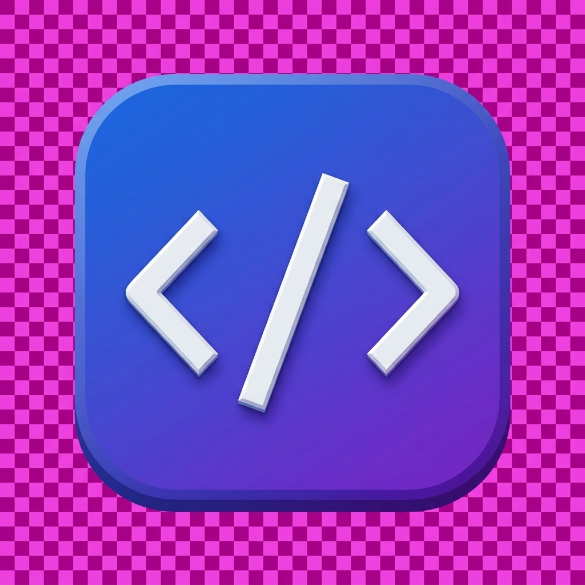

# CodeBridge — AI-Powered Code Translator 🚀

**CodeBridge** is a premium, modern web application designed to translate source code across multiple programming languages using advanced AI. Powered by Google's **Gemini 1.5 Flash**, it preserves logic, naming conventions, and code structure while moving your projects from one language to another.



## ✨ Features

- **🎯 Logic-Preserving Translation:** Uses AI to ensure that the intent and logic of your code remain intact across different syntaxes.
- **⚡ Instant Results:** Powered by Gemini 1.5 Flash for sub-second translation speeds.
- **🌐 Multilingual Support:** Seamlessly translate between 12+ languages including Java, Python, JavaScript, TypeScript, C++, Rust, Go, and more.
- **🎨 Premium UI/UX:** A sleek, dark-mode interface with glassmorphism effects, particle animations, and a responsive design.
- **🔒 Zero Storage:** Your code is processed in real-time and never stored or logged, ensuring your intellectual property stays yours.

## 🛠️ Tech Stack

### Frontend
- **React 19** (Vite-powered)
- **Vanilla CSS** (Custom design system with glassmorphism)

### Backend
- **Node.js** & **Express**
- **Google Generative AI SDK** (Gemini API)
- **CORS** & **Dotenv** for secure configuration

---

## 🚀 Getting Started

### Prerequisites
- [Node.js](https://nodejs.org/) (v18 or higher)
- A **Gemini API Key** from [Google AI Studio](https://aistudio.google.com/)

### Installation

1. **Clone the repository:**
   ```bash
   git clone https://github.com/your-username/codebridge-translator.git
   cd codebridge-translator
   ```

2. **Setup the Backend:**
   ```bash
   cd backend
   npm install
   ```
   Create a `.env` file in the `backend` folder:
   ```env
   GEMINI_API_KEY=your_api_key_here
   PORT=5000
   ```

3. **Setup the Frontend:**
   ```bash
   cd ../frontend
   npm install
   ```

### Running the App

To run the full application, you need to start both the backend and the frontend in separate terminals:

**Terminal 1 (Backend):**
```bash
cd backend
node server.js
```

**Terminal 2 (Frontend):**
```bash
cd frontend
npm run dev
```

The app will be available at `http://localhost:5173`.

---

## 📸 UI Preview
- **Logo:** Centered, premium branding.
- **Panels:** Side-by-side code editors with line numbering.
- **Animations:** Interactive particle backgrounds and smooth transitions.

## 📄 License
This project is licensed under the MIT License.

---
*Built with ❤️ for CodeBridge*
